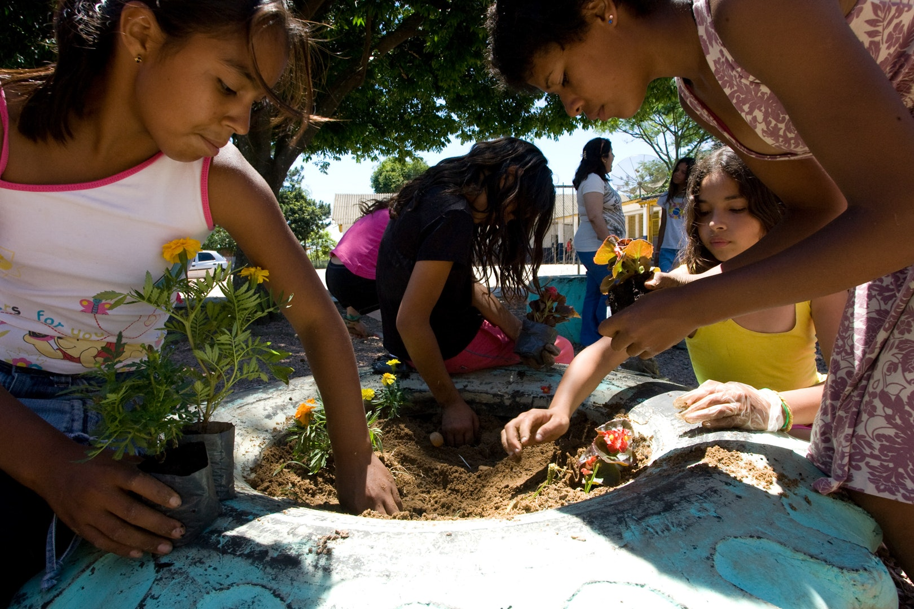

Falling between the ages of 12 and 15 and representing a transition from childhood to youth,
young adolescents—referred to as “junior youth”—experience rapid physical, intellectual, and
emotional changes. Their spiritual powers expand. A new level of awareness fosters in them an
increased interest in profound questions and in their talents and abilities. During this short and
critical three-year period, ideas about the individual and society that may very well shape the rest
of their lives are formed. However, delight at these new powers is often combined with feelings of worry,
discomfort, and doubt that may produce contradictions in behaviour. Directing their new abilities
towards selfless service to humanity is therefore needed at this age.

At the hearts of the Junior Youth Spiritual Empowerment Programme lies the concept of spiritual empowerment.
Through its various facets, the programme seeks to release the intellectual and spiritual powers of
young adolescents and direct them towards service to humanity. The conception of power employed here
differs greatly from prevalent definitions that associate it with the intention to dominate or to induce
others to acquiesce to one's wishes and demands. The aim is, instead, to become channels for the flow of
the powers of the human spirit: the power of unity, of love, of humble service, of pure deeds.
In this connection, the programme tries to engage the expanding consciousness of junior youth in an
exploration of reality that helps them to recognize the constructive and destructive forces at work
in society and to understand the influence these forces exert on their thoughts and actions,
sharpening their spiritual perception, enhancing their ability to draw on the power of the word,
reinforcing moral structures that will serve them throughout their lives.

<blockquote>
   "Although your realities are shaped by a broad diversity of circumstances, 
   yet a desire to bring about constructive change and a capacity for meaningful service, 
   both characteristic of your stage of life, are neither limited to any race or nationality, 
   nor dependent upon material means. This bright period of youth you share is experienced by 
   all—but it is brief, and buffeted by numerous social forces. How important it is, then, to 
   strive to be among those who, in the words of ‘Abdu’l-Bahá, ‘plucked the fruit of life’."

   
— The Universal House of Justice

</blockquote>

<blockquote>
  "The primary function of a junior youth group is to serve as an environment of
  mutual support for its members, one in which they can develop the spiritual
  perception and patterns of thought and behavior that will characterize them
  throughout their lives. Normally, a junior youth group meets once a week,
  though sometimes more, over a three-year period and studies materials that
  have been specifically developed for their age group. Studying occupies only a
  portion of the time the youth spend together. During the rest of the time,
  they consult on and plan service projects, participate in sports, and engage
  in cultural activities, such as drama and crafts, suited to their immediate
  surroundings. In addition to regular meetings, the group attends special
  events and undertakes acts of service to the community."
  
- Releasing the Powers of Junior Youth

</blockquote>
